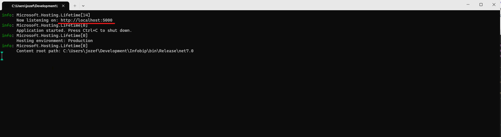
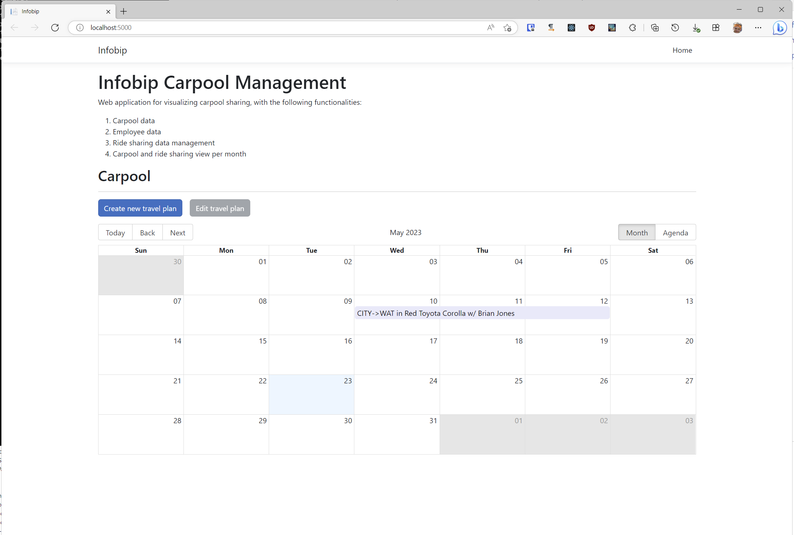

# Infobip Carpool

## Installation

- Download and unpack the file from `Published release`
- In the directory of the unpacked files run the program `Infobip.exe`
- The server application will start and present a console similar to the following 

- In the Web browser navigate to the underlined link (here `http://localhost:5000`)
- The client side of the application will be displayed

## Usage 
- Click on the button `Create new travel plan`, fill out the required data and click `Submit`. The new carpool event will be displayed.
- Click on an existing carpool event in the calendar. Click on the button `Edit travel plan` to amend the details of the 
  carpool event; or to delete the event.
